<!--toc:start-->
- [Introduzione](#introduzione)
  - [Autore](#autore)
  - [Link ed informazioni utili](#link-ed-informazioni-utili)
- [Struttura dell'Applicazione](#struttura-dellapplicazione)
  - [Front-End](#front-end)
  - [Back-End](#back-end)
  - [NODEJS](#nodejs)
    - [NODEJS ed EXPRESS](#cose-nodejs-ed-express)
    - [File NODEJS](#file-nodejs)
  - [Database MONGODB](#database-mongodb)
    - [ALBUMS](#albums)
    - [CARDS](#cards)
    - [USERS](#users)
    - [EXCHANGES](#exchanges)
    - [EXCHANGES_CARDS](#exchanges_cards)
- [Configurazione dell'applicazione](#configurazione-dellapplicazione)
- [Scelte implementative e features](#scelte-implementative-e-features)
  - [Swagger JS](#swagger-js)
  - [File SWAGGER.JS](#file-swaggerjs)
  - [Interfaccia grafica SWAGGER](#interfaccia-grafica-swagger)
  - [Installazione](#installazione)
  - [Gestione codici HTTP](#gestione-codici-http)
  - [Esempi di Utilizo](#esempi-di-utilizo)
  - [Personaggi Marvel](#personaggi-marvel)
  - [Lingua](#lingua)
  - [Tema](#tema)

<!--toc:end-->

# Introduzione

Questo documento rappresenta la relazione del progetto "Album delle figurine dei super eroi", sviluppato nel contesto del corso "Programmazione Web e mobile" durante l'anno accademico 2024/2025.

### Autore
Il progetto è stato realizzato da:

- [Stefano Damiani](https://github.com/studentedamiani) (Matricola: 976496)

### Link ed informazioni utili
- La pagina GitHub del progetto si trova a <a href="https://github.comstudentedamianiProgettoMarvelPWM">questo link</a>
# Struttura dell'Applicazione

## Front-End
> **Front End:** 
Il Front-End è la parte dell'applicazione che si occupa dell'interfaccia utente e dell'interazione con l'utente. Si concentra sulla progettazione e sull'implementazione dell'aspetto visivo dell'applicazione e sulla gestione delle interazioni utente.

All'interno della directory `/public/`, sono presenti i seguenti elementi principali:

- `/html/` Questa directory contiene i file HTML che vengono renderizzati da browser, determinando quindi interfaccia grafica dell'applicazione. Tutti i files sono stati validati per lo standard HTML5.

- `/css/`: Questa directory contiene i file di stile che definiscono l'aspetto visivo dell'applicazione. Tutti i files sono stati validati per lo standard CSS3. I file principali sono:
  - /public/css/style.css - _Questo file definisce lo stile generale dell'applicazione_
  -  /public/css/card.css - _Questo file definisce lo stile che riguarda le figurine e tutti i personaggi_

- `/scripts/`: Questa directory contiene file JavaScript che gestiscono la logica del Front-End. Alcuni dei file principali includono:
  - /public/scripts/theme.js - _Questo file si occupa di adattare il tema dell'applicazione a quello definito dal sistema dell'utente_
  - /public/scripts/navbar.js - _Questo file si occupa di definire la barra di navigazione sulle pagine in cui è richiesta e gestisce il caricamento della pagina di login e verifica quando l'utente è loggato._
  - /public/scripts/footer.js - _Questo file si occupa di il footer sulle pagine in cui è richiesto._
  - /public/scripts/login.js - _Questo file si occupa di tutte le operazioni necessarie al login dell'utente_
  - /public/scripts/register.js - _Questo file si occupa delle operazioni necessarie alla registrazione di un utente. Si occupa anche di caricare i dati dei supereroi per fare selezionare all'utente il suo preferito_
  - /public/scripts/marvel.js - _Questo file si occupa di gestire la maggior parte di ciò che riguarda i personaggi Marvel._

La suddivisione chiara tra file HTML, file CSS e file JavaScript consente una gestione efficiente del Front-End e garantisce un'esperienza utente di alta qualità.

## Back-End
> **Back End:** 
Il Back-End è responsabile delle funzionalità e della logica dell'applicazione lato server. Esso comprende una serie di elementi chiave presenti nella nostra struttura di lavoro.

### NODEJS

#### COS'E' NODEJS ED  EXPRESS
**Node.js** ed **Express** costituiscono un binomio potente nell'ambito dello sviluppo web di applicazioni scalabili ed efficienti. <br>*Node.js* fornisce un ambiente runtime JavaScript server-side, ottimizzato per l'efficienza e la scalabilità. 
<br>*Express*, un framework web basato su Node.js, semplifica la creazione di applicazioni web, offrendo funzionalità come la gestione delle richieste HTTP e dell'autenticazione. <br>

#### File NODEJS

- `/lib/api/docs/`: In questa directory sono presenti i file utilizzati per la gestione della documentazione pubblica delle API dell'applicazione, inclusi:
  - swagger.js
  - swagger_output.js

- `/config/`: Questa cartella contiene i file dedicati alla configurazione dell'applicazione, ad eccezione delle variabili d'ambiente. Al suo interno, sono presenti:
  - prefs.js - _Questo file viene utilizzato per caricare i valori inseriti dall'utente in modo che siano direttamente utilizzabili

- `/lib/`: La directory lib contiene tutte le funzioni Node.js utilizzate per le funzionalità degli endpoint. Inoltre
Alcuni dei file e delle directory principali sono:
  - /lib/database.js
  - /lib/login.js
  - /lib/marvel.js
  - /lib/register.js
  - /lib/utils.js

- `app.js`: Questo file rappresenta il punto di ingresso principale dell'applicazione, contenente le istruzioni per l'avvio dell'app e la definizione degli endpoint.

La struttura ben organizzata del Back-End garantisce una gestione efficiente delle funzionalità server-side e contribuisce al corretto funzionamento dell'applicazione.

### Database MONGODB

Nel corso di sviluppo dell'applicazione, è stato fatto largo uso del database MongoDB. Qui di seguito, vengono presentate le collezioni sono state create e utilizzate per immagazzinare i dati essenziali dell'applicazione.

> **MongoDB:** MongoDB è un database NoSQL (non relazionale), flessibile e scalabile, noto per la sua struttura orientata ai documenti. Un documento è un record dati in formato BSON (Binary JSON) che può contenere dati di varie forme e dimensioni. Ogni documento è organizzato in *collezioni*, offrendo flessibilità nella modellazione dei dati.
Per lo sviluppo di questa applicazione è stato deciso di appoggiarsi ad una versione Hosted di MongoDB, fornita da Atlas ([Maggiori informazioni](https://www.mongodb.com/it-it/atlas))

Per questa applicazione sono state utilizzate le seguenti collections:
- **albums**: Collezione che gestisce informazioni degli album di figurine
- **cards**: Collezione che gestisce le carte presenti all'interno di ogni album
- **users**: Collezione che gestisce i dati degli utenti
- **exchanges**: Collezione che gestisce gli scambi proposti dagli utenti
- **exchanges_cards**: Collezione che gestisce le carte proposte all'interno degli scambi

Di seguito viene riportata una descrizione delle collections e del loro schema

#### ALBUMS
##### DESCRIZIONE
La collezione *albums* ha lo scopo di raccogliere l'anagrafica degli album di figurine degli utenti

##### ATTRIBUTI
- **_id**: identificatore univoco di una album, di tipo ObjectId. È un campo obbligatorio per identificare univocamente un album nel db.

- **userId**: identificatore dell'utente creatore dell'album, di tipo ObjectId. È un campo obbligatorio e serve a linkare l'album al suo creatore.

- **name**: nome dellì'album, di tipo stringa. È un campo obbligatorio e contiene il nome dell'album.

#### CARDS

##### DESCRIZIONE
La collezione *cards* è stata creata per salvare le carte trovate dagli utenti dentro i pacchetti e linkarle all'album in uso in quel momento

##### ATTRIBUTI
- **_id**: identificatore univoco dell'associazione Carta-Album, di tipo ObjectId. È un campo obbligatorio per identificare univocamente una carta nel database.

- **user_Id**: identificatore dell'utente proprietario della carta, di tipo ObjectId. È un campo obbligatorio e serve a linkare la carta al suo proprietario.

- **album_Id**: identificatore dell'album in cui la carta è inserita. Di tipo Stringa. È un campo obbligatoro e serve a linkare la carta all'album.

- **card_Id**: Id del personaggio fornito direttamente dalle API Marvel. Di tipo Numerico. Serve per identificare e collegare alle informazioni fornite da Marvel la carta

#### USERS

##### DESCRIZIONE
La collezione *users* è destinata a contenere i dati degli utenti all'interno dell'applicazione. 

##### ATTRIBUTI
- **_id**: identificatore univoco di un utente, di tipo ObjectId. È un campo obbligatorio per identificare univocamente un utente nel database.

- **name**: nome dell'utente, di tipo stringa. È un campo obbligatorio e contiene il nome dell'utente.

- **surname**: cognome dell'utente, di tipo stringa. È un campo obbligatorio e contiene il cognome dell'utente.

- **username**: username dell'utente, di tipo ObjectId. È un campo obbligatorio e contiene la login, alternativa all'email, dell'utente.

- **email**: indirizzo email dell'utente, di tipo stringa. È un campo obbligatorio e contiene l'indirizzo email dell'utente.

- **password**: password dell'utente, di tipo stringa. È un campo obbligatorio e contiene la password dell'utente cifrata.

- **date**: data di nascita dell'utente, di tipo stringa. È un campo obbligatorio e contiene la data di nascita dell'utente.

- **superhero**: codice identificativo supereroe Marvel. È un campo obbligatorio e contiene il supereroe preferito dell'utente.

- **credits**: numero di crediti attualmente in possesso dell'utente. In fase di creazione corrispondono a 0. Campo obbligatorio

#### EXCHANGES

##### DESCRIZIONE
La collezione *exchanges* è stata creata per salvare gli scambi di figurine proposti dagli utenti.

##### ATTRIBUTI
- **_id**: identificatore univoco dello scambio, di tipo ObjectId. È un campo obbligatorio per identificare univocamente uno scambio nel database.

- **user_Id**: identificatore dell'utente proprietario della scambio, di tipo ObjectId. È un campo obbligatorio e serve a linkare lo scambio al suo proprietario.

- **album_Id**: identificatore dell'album da cui l'utente vuole scambiare. Di tipo Stringa. È un campo obbligatoro e serve a linkare lo scambio all'album.

- **requestedCard**: Id del personaggio richiesto per lo scambio, nella sintassi fornita direttamente dalle API Marvel. Di tipo Stringa. Serve per identificare la carta che viene acquisita quando un'altro utente accetta lo scambio

#### EXCHANGES_CARDS

##### DESCRIZIONE
La collezione *exchanges_cards* è stata creata per salvare le carte da donare durante uno scambio. È stata definita una tabella separata per permettere di dare più carte per una sola carta.

##### ATTRIBUTI
- **_id**: identificatore univoco dell'associazione Carta-Scambio, di tipo ObjectId. È un campo obbligatorio per identificare univocamente l'associazione nel database.

- **exchange_id**: identificatore univoco dello scambio, di tipo ObjectId. È un campo obbligatorio per identificare univocamente linkare la carta allo scambio.

- **user_id**: identificatore dell'utente proprietario della carta, di tipo ObjectId. È un campo obbligatorio e serve a linkare la carta e lo scambio al suo proprietario.

- **album_id**: identificatore dell'album in cui la carta doppia proposta è inserita. Di tipo Stringa. È un campo obbligatoro e serve a linkare la carta all'album, in modo che se la carta viene venduta nell'album lo scambio viene eliminato.

- **card_Id**: Id del personaggio fornito direttamente dalle API Marvel. Di tipo Numerico. Serve per identificare e collegare alle informazioni fornite da Marvel la carta proposta nello scambio

# Configurazione dell'applicazione
Il progetto necessita di un file `.env` nella directory principale del dove sono contenuti i
parametri necessari per il funzionamento.
Il file `.env` è gestito attraverso il pacchetto npm [dotenv](https://www.npmjs.com/package/dotenv)
che si occupa di popolare le relative variabili d'ambienti e renderne semplice l'utilizzo e accesso
tramite JavaScript.

*Un esempio di file env*

```sh
# Server HOST and PORT
HOST='localhost'
PORT=666

# Parametri e Credenziali MongoDB
DB_USERNAME=your_database_user - #Pay attention, this is the App user, not the manageruser
DB_PASSWORD= your_database_user_password
DB_CLUSTER=link_to_your_cluster
DB_OPTIONS=retryWrites=true&w=majority&appName=your_app_name
DB_DBNAME = your_DB_NAME


# Parametri e Credenziali Marvel
BASE_URL=http://gateway.marvel.com/v1/
PUBLIC_KEY=YOUR_PUBLIC_KEY_FROM_MARVEL
PRIVATE_KEY=YOUR_PRIVATE_KEY_FOR_MARVEL
```

# Scelte implementative e features
## Swagger JS
>**Swagger:** è un framework open-source per la progettazione, la creazione e la documentazione di API RESTful. La sua utilità si concentra sulla semplificazione del processo di sviluppo API, consentendo agli sviluppatori di definire chiaramente le specifiche delle API, testarle e generare automaticamente documentazione dettagliata.

Per la generazione dello swagger ho utilizzato il module <a href="https://www.npmjs.com/package/swagger-autogen">swagger-autogen.</a>

Tramite la creazione di un file *swagger.js* (/lib/api/docs/) con una apposita configurazione e determinati commenti nella sezione degli endpoint, è possibile generare automaticamente una documentazione per gli endpoint.

è possibile visualizzare lo swagger generato all'endpoint **/api-docs**

##### File SWAGGER.JS 
>**NB**: Il codice riportato di seguito rappresenta un esempio molto vicino a quello utilizzato in questa applicazione!
```javascript
import swaggerAutogen from 'swagger-autogen';
import { config } from "../../../config/prefs.js";
const outputFile = './swagger-output.json';
const endpointsFiles = ['../../*.js', '../../../app.js'];  // This will match all .js files in lib folder and its subfolders, plus app.js

const doc = {
  "info": {
    "title": "Marvel Characters API",
    "description": "API for AFSE (Album delle Figurine dei Super Eroi)",
    "version": "1.0.0"
  },
  host: `${config.host}:${config.port}`,
  basePath: "/",
  schemes: ['http'],
  consumes: ['application/json'],
  produces: ['application/json'],
  tags: [
    {
     "name": "fetch",
     "description": "Basic endpoint."
    },
    {
      "name": "users",
      "description": "Endpoints for the management of user data and related operations."
    },
    {
     "name": "auth",
     "description": "Endpoints related to authentication and user authorization."
    },
    {
     "name": "cards",
     "description": "Endpoints for managing the cards of the album."
    },
    {
      "name": "exchanges",
      "description": "Endpoint to manage exchanges."
    },
    {
    "name": "database",
    "description": "Endpoint to check the database connection."
  }
  ],
  definitions: {
    user: {
      _id: "ObjectId('64df73b31e5eda5eb868ddcd')",
      name: "John",
      username: "Jhonny",
      surname: "Doe",
      email: "jhonny@example.com",
      password: "hashed_password",
      credits: 100,
      superhero : 1011006
    },
    
      loggeduser: {
           $_id: "64df73b31e5eda5eb868ddcd",
           $username:"johndough",
           $email: "johndough@gmail.com",
           $name: "John"
      },
      loginrequest: {
        email: "johndough@gmail.com",
        username:"johndough",        
        $password: "password"  
      }
  }
    };
  const swagger = swaggerAutogen(outputFile, endpointsFiles, doc)
```
##### Interfaccia grafica SWAGGER
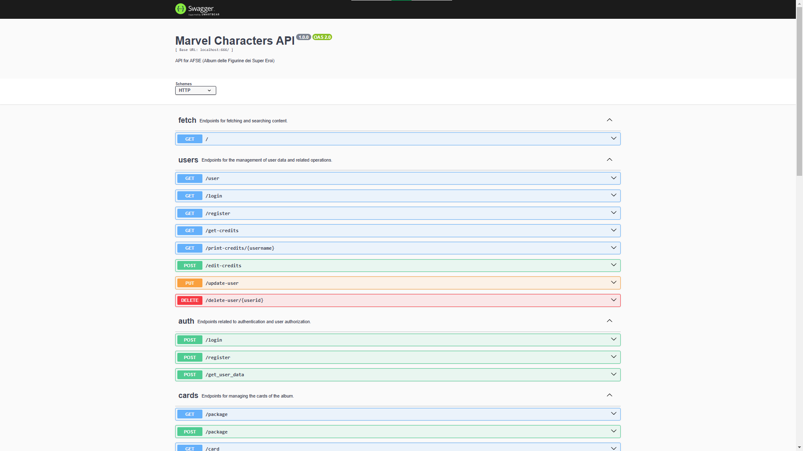
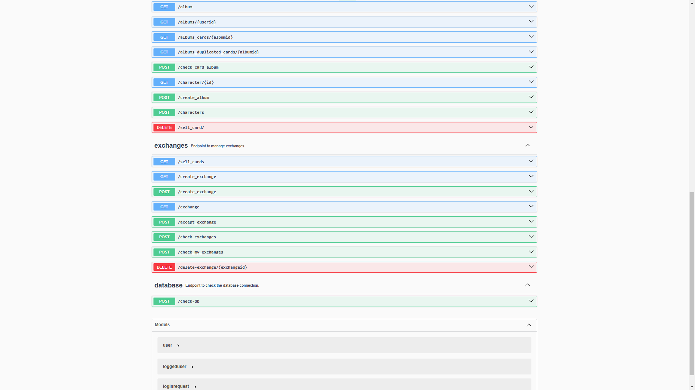

##### Installazione
``` npm install --save-dev swagger-autogen ```<br>
ulteriori informazioni sono presenti al link sopra riportato

---

## Gestione codici HTTP

>I codici HTTP sono standard utilizzati per indicare lo stato di una richiesta HTTP effettuata tra un client (spesso un browser web) e un server. Nell'applicazione, vengono ampiamente utilizzati alcuni di questi codici per comunicare lo stato delle richieste e delle risposte:

- **Codice 400 (BAD REQUEST)**: Questo codice indica che la richiesta effettuata dal client è stata malformata o non valida. Viene utilizzato quando i dati inviati non corrispondono alle aspettative del server.

- **Codice 401 (UNAUTHORIZED)**: Indica che l'accesso a una risorsa richiede l'autenticazione. 

- **Codice 404 (NOT FOUND)**: Indica che la risorsa richiesta non è stata trovata sul server. 

- **Codice 500 (INTERNAL SERVER ERROR)**: Questo codice indica un errore interno del server.

- **Codice 200 (OK)**: Codice di successo. Indica che la richiesta è stata elaborata correttamente e che il server sta restituendo i dati richiesti al client.

---

### Esempi di Utilizo

**Pagina Iniziale**
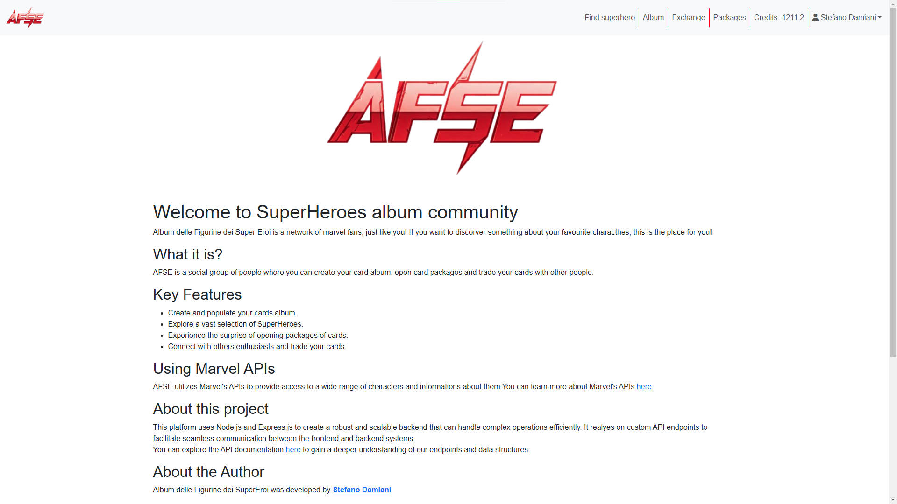

**Profilo**
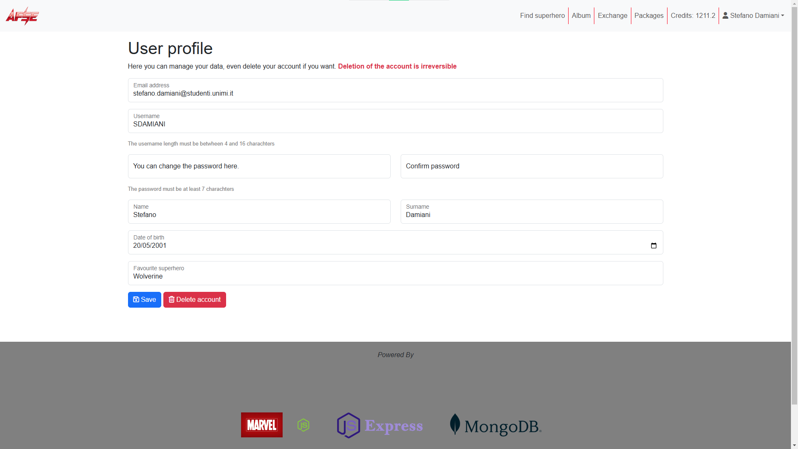

**Cerca superEroe - Non ancora trovato**


**Cerca superEroe - Trovato**
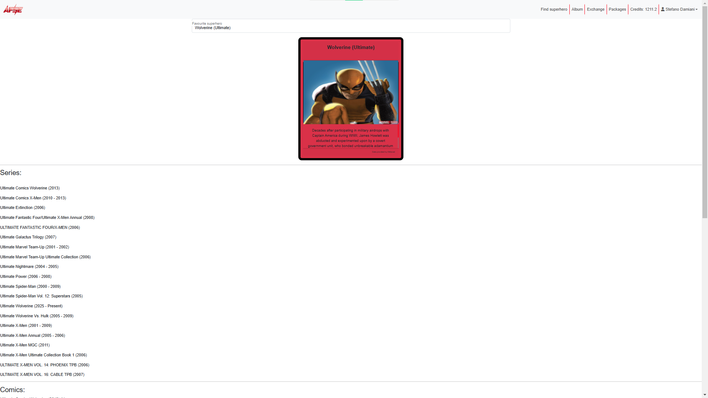

**Album**
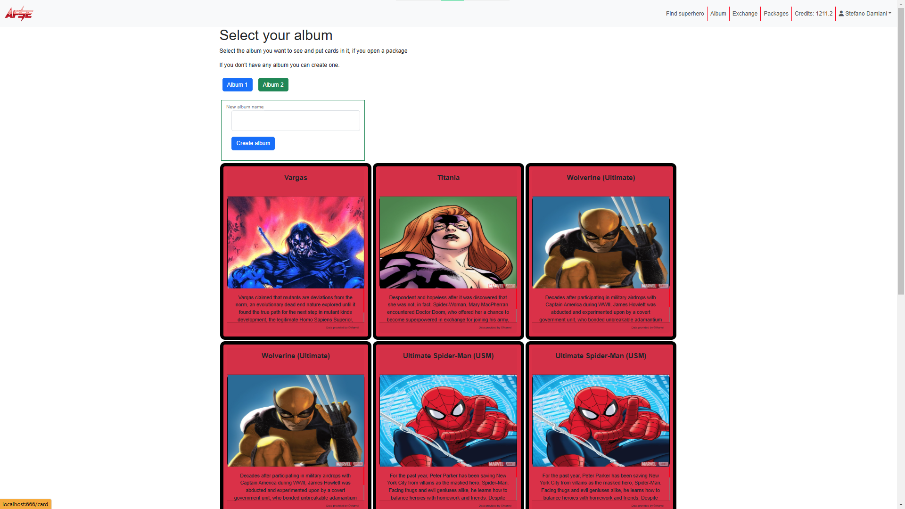

**Scambi - Pagina base**
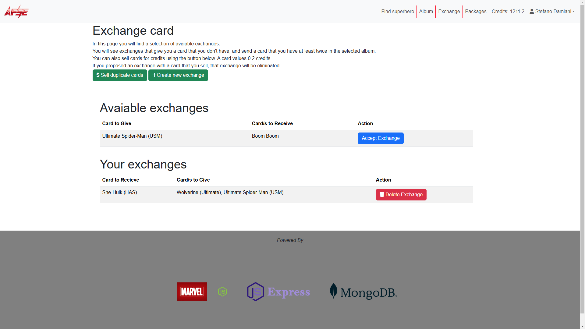

**Scambi - Crea scambio**
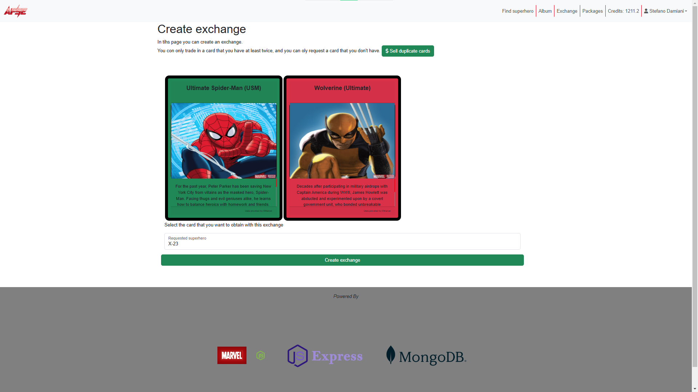

**Scambi - Vendi carte**
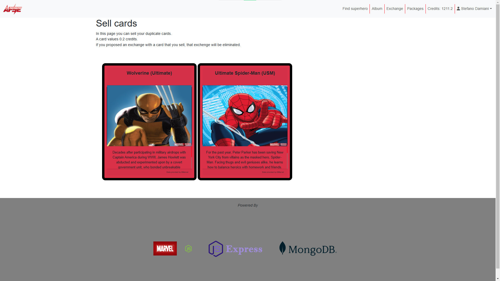

**Pacchetti - Pacchetto non aperto**
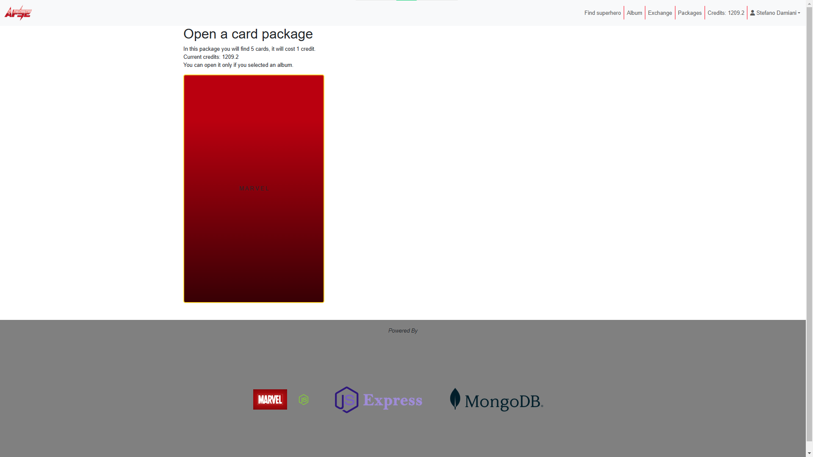

**Pacchetti - Pacchetto aperto**
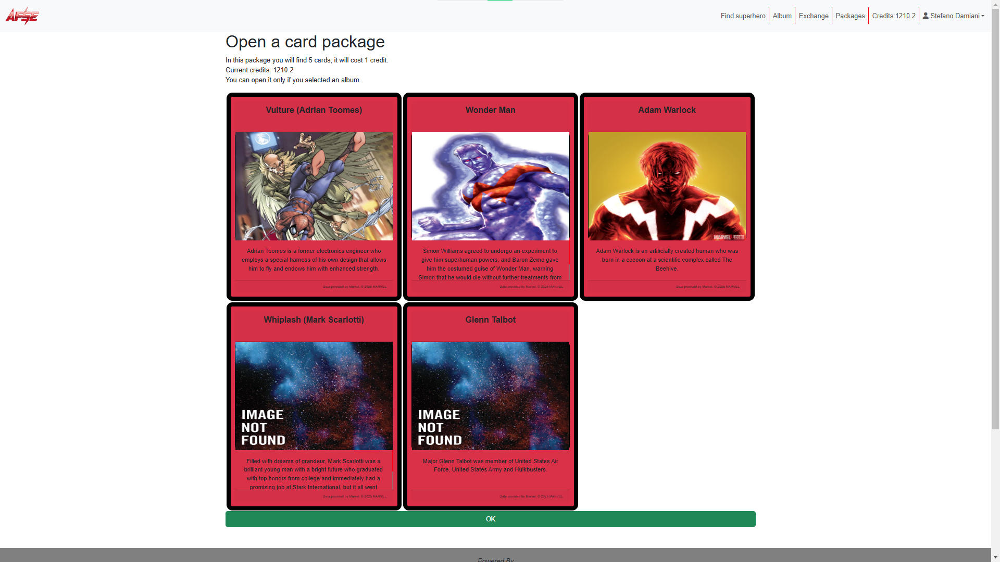

**Crediti - Acquista crediti**
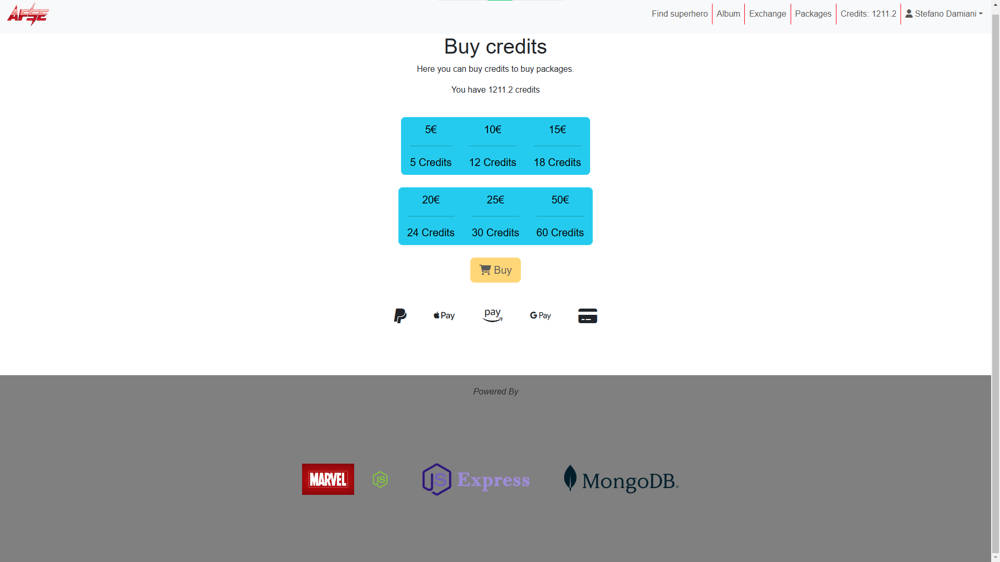

**Tema scuro - Pagina iniziale**


**Tema scuro - Album**
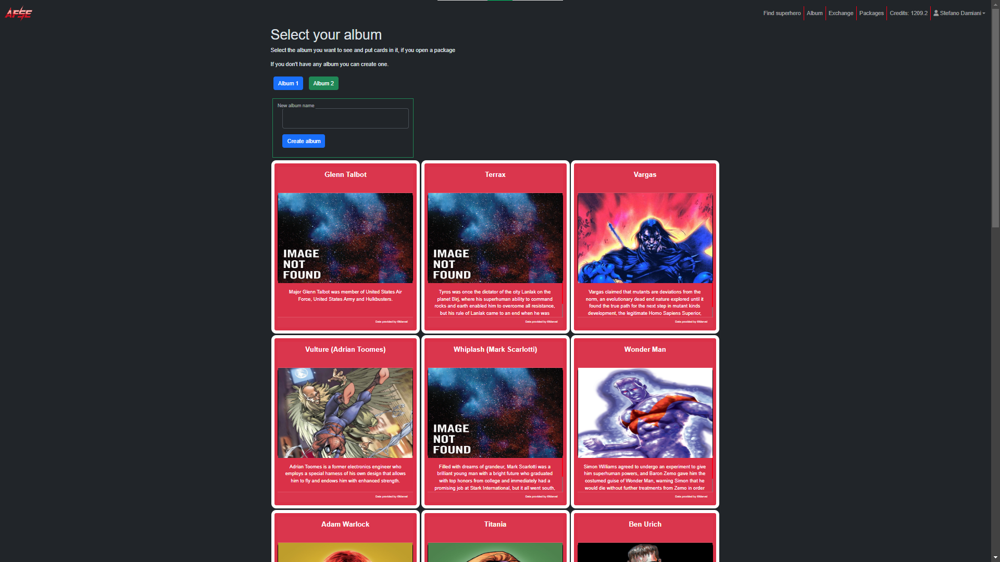

---

## Personaggi Marvel
I personaggi Marvel, per essere utilizzati all'interno dell'applicazione devono essere validati. 
Per essere validi essi devono obbligatoriamente avere un nome, una descrizione e un'immagine, che può essere quella di default.
Tutti i personaggi non validi non vengono presi in considerazione dall'applicazione.

---

## Lingua
La scelta di utilizzare la lingua inglese, come standard di programmazione, è ampiamente diffusa nell'industria del software ed è guidata principalmente dal desiderio di aderire allo standard internazionale. Questo standard è anche noto nella community di programmatori come **"English-based programming"** . <br>
Adottare questa convenzione ha numerosi vantaggi, in quanto rende il codice più leggibile e comprensibile per un pubblico globale di sviluppatori. La scelta è derivata anche dalla decisione di rendere il progetto, dopo la conclusione, un applicazione open-source. La scelta della licenza MIT rispecchia questa scelta.

---

## Tema
L'applicazione è disponibile sia con un tema chiaro e sia con un tema scuro. L'applicazione si adatta automaticamente alle preferenze dell'utente, come visto sopra.